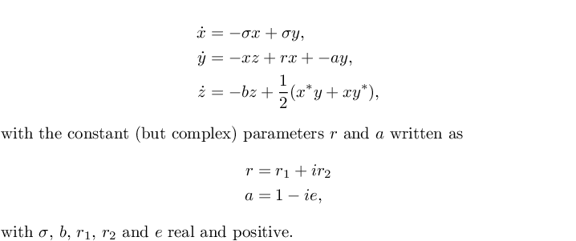

# Examples of the dense output capabilities of the dopri5 and dop853 ODE solvers using proposed scipy modifications

To use these examples, scipy must have the new dense output capabilities from: https://github.com/jddmartin/scipy

The examples are:

1. [`arenstorf.py`](examples/arenstorf.py)
2. [`van_der_pol.py`](examples/van_der_pol.py)
3. [`complex_lorenz.py`](examples/complex_lorenz.py)

The first two examples simply reproduce output similar to the example Fortran driver code given by Hairer (see docstrings for links).  Here I will briefly discuss the third example:  [`complex_lorenz.py`](examples/complex_lorenz.py)

The scipy wrappers for DOPRI5 and DOP853 allow differential equations to be solved that involve complex number components and derivatives (but in *real* time only).  The `complex_lorenz.py` example was chosen to show that the dense output extension can also be used for one of these systems: the so-called "Complex Lorenz" system as studied by Fowler *et al.* http://dx.doi.org/10.1016/0167-2789(82)90057-4

The specific trajectory shown below replicates Fig. 1 of Fowler *et al.*  (see the code for the parameters and initial conditions). The top plot illustrates the normal output integration steps of DOP853 for the requested accuracy.  Connecting these steps by straight lines results in a "jagged" visually unappealing plot.  

The bottom figure shows the use of the new dense output capabilities. After each step the evaluation of an interpolating polynomial (with coefficients supplied by DOP853) between the last and current step allow a smooth curve to be drawn, resulting in a more visually pleasing plot.

