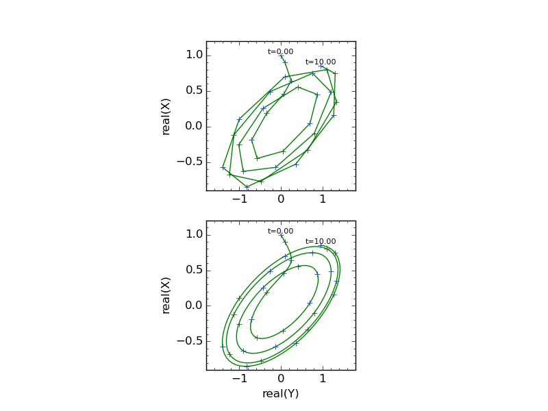

### Examples of obtaining dense output from the DOPRI5 and DOP853 ordinary differential equation solvers using proposed scipy modifications

To run these examples, scipy must have the proposed dense output capabilities from: https://github.com/jddmartin/scipy

The examples are:

1. [`arenstorf.py`](examples/arenstorf.py)
2. [`van_der_pol.py`](examples/van_der_pol.py)
3. [`complex_lorenz.py`](examples/complex_lorenz.py)

The first two examples simply reproduce output similar to the example Fortran driver code given by Hairer (see docstrings for links).  Here I will briefly discuss the third example:  [`complex_lorenz.py`](examples/complex_lorenz.py), which is written in a more "pythonic" form than the other two.

The scipy wrappers for DOPRI5 and DOP853 allow differential equations to be solved that involve complex number components and derivatives (but only in *real* time).  The [`complex_lorenz.py`](examples/complex_lorenz.py) example illustrates that the dense output extension can be used for a system of this type: the so-called "Complex Lorenz" system as studied by Fowler *et al.* 
http://dx.doi.org/10.1016/0167-2789(82)90057-4

Under certain conditions this system will tend towards a stable elliptical limit cycle in the real(X), real(Y) plane.  The specific trajectory shown below replicates Fig. 1 of Fowler *et al.*  (see the code [`complex_lorenz.py`](examples/complex_lorenz.py) for the parameters and initial conditions). The top plot illustrates the normal output integration steps of DOP853 for the requested accuracy.  Connecting these steps by straight lines results in a "jagged", unappealing plot.  

The bottom figure shows the use of the new dense output capabilities. After each step, the evaluation of an interpolating polynomial (with coefficients supplied by DOP853) between the last and current step allows a smooth and more visually pleasing plot to be drawn.

